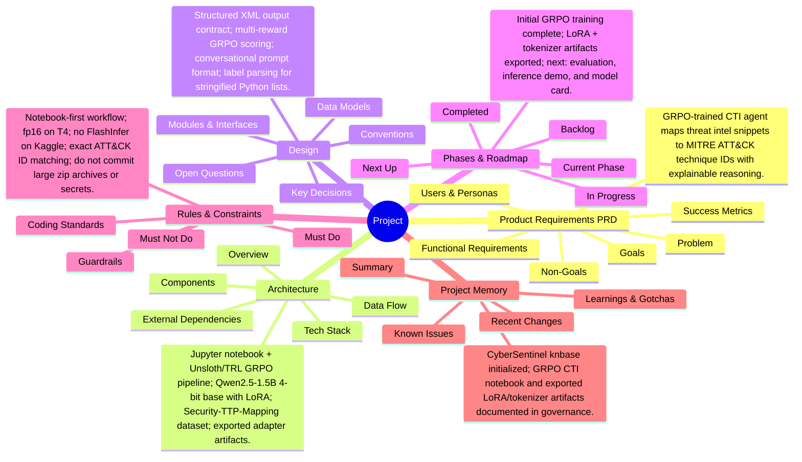

# Project Mind Map

<!-- Auto-generated by knbase. Do not edit by hand. -->

## Index

| File | State | Summary |
| --- | --- | --- |
| prd | ok | GRPO-trained CTI agent maps threat intel snippets to MITRE ATT&CK technique IDs with explainable reasoning. |
| architecture | ok | Jupyter notebook + Unsloth/TRL GRPO pipeline; Qwen2.5-1.5B 4-bit base with LoRA; Security-TTP-Mapping dataset; exported adapter artifacts. |
| design | ok | Structured XML output contract; multi-reward GRPO scoring; conversational prompt format; label parsing for stringified Python lists. |
| phase | ok | Initial GRPO training complete; LoRA + tokenizer artifacts exported; next: evaluation, inference demo, and model card. |
| rules | ok | Notebook-first workflow; fp16 on T4; no FlashInfer on Kaggle; exact ATT&CK ID matching; do not commit large zip archives or secrets. |
| memory | ok | CyberSentinel knbase initialized; GRPO CTI notebook and exported LoRA/tokenizer artifacts documented in governance. |

_Updated: 2026-07-17T13:36:06.488Z_
