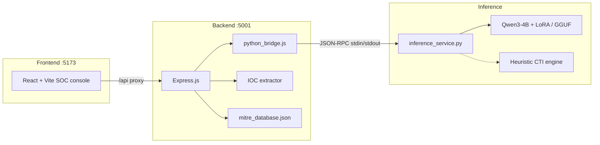

# CyberSentinel

**Explainable CTI analyst AI** — maps unstructured cyber threat intelligence to MITRE ATT&CK techniques, with chain-of-thought reasoning you can audit.

Paste an EDR log, malware write-up, or CTI snippet. CyberSentinel returns:

- Step-by-step analysis in `<reasoning>` tags
- A single ATT&CK technique ID in `<answer>` tags (`T1059`, `T1059.001`, …)
- Enriched tactic / technique metadata
- Extracted IOCs (IPs, domains, hashes, registry keys, binaries)

The policy is a **Qwen3-4B-Instruct-2507** model (Apache-2.0) fine-tuned with **GRPO** (Group Relative Policy Optimization) on [`tumeteor/Security-TTP-Mapping`](https://huggingface.co/datasets/tumeteor/Security-TTP-Mapping). A full-stack SOC console sits on top of the same inference contract.

> **Model choice:** Qwen2.5-3B is deliberately *not* used — it ships under the non-commercial `qwen-research` licence. Qwen3-4B-Instruct-2507 is Apache-2.0, larger, and is the non-thinking variant, so it never emits `<think>` blocks that would collide with the `<reasoning>`/`<answer>` contract.

> This project classifies and explains observed adversary behavior. It does not generate exploits, payloads, or attack procedures.

---

## Features

- **Explainable mapping** — reasoning drawer + MITRE technique badge, not a black-box ID
- **Local inference** — a quantised GGUF via llama.cpp (Metal / CPU, ~2.5 GB), or the full base model + LoRA via transformers on CUDA / MPS / CPU
- **SOC console** — dark-theme React UI, investigation sessions, ATT&CK matrix navigator
- **IOC extraction** — IPs, domains, hashes, registry paths, binaries, suspicious APIs; CSV / markdown export
- **Benchmark probes** — eight held-out-style CTI samples with expected technique IDs
- **GRPO training notebook** — Unsloth 4-bit + vLLM + TRL, targeted at a 16GB Kaggle T4

---

## Architecture



**Decide vs. display.** The Python process owns generation and XML parsing. Express enriches the technique ID from a local ATT&CK catalog, extracts IOCs, and serves the SPA. The browser never talks to the model directly.

| Layer | Path | Role |
| --- | --- | --- |
| Training (RunPod) | `train_runpod.py` + `malware-behavior-runpod.ipynb` | GRPO fine-tune on an A6000, bf16, GGUF export |
| Training (Kaggle) | `malware-behavior.ipynb` | Original T4 notebook, fp16 |
| Evaluation | `evaluate_cti_agent.py` | Format adherence, accuracy, reasoning length |
| Weights | `grpo_cti_tokenizer_model/`, `grpo_cti_lora_adapters/` | Tokenizer + PEFT LoRA (not committed) |
| API | `backend/` | Express routes + Python bridge |
| Console | `frontend/` | Sessions, chat, matrix, IOC drawer |
| Prompt contract | [`PROMPT.md`](./PROMPT.md) | Recreation prompt, system prompt, sample probes |

---

## Quick start

### Prerequisites

- Node.js 18+
- Python 3.10+ (3.12 recommended)
- For live inference, either:
  - **`llama-cpp-python` + a `.gguf`** (recommended — ~2.5 GB, runs on a laptop), or
  - `torch`, `transformers`, `peft` for the unquantised base model + LoRA (~8 GB)

### Install and run (development)

```bash
# from repo root
npm install
cd backend && npm install && cd ../frontend && npm install && cd ..

# both processes: Express :5001 + Vite :5173
npm run dev
```

Open **http://localhost:5173**. Vite proxies `/api` to the backend.

### Production-style serve

```bash
npm run build    # builds frontend/dist and installs backend deps
npm start        # Express on :5001, serves the SPA if dist exists
```

### Docker

The whole stack — API, Python inference service, and built SPA — runs from one image:

```bash
docker compose up --build -d     # http://localhost:5001
docker compose logs -f           # watch the model load
```

Drop a `.gguf` into `./models/` first — compose mounts it read-only and the container
serves it with llama.cpp (~2.5 GB, ~4 GB of RAM). Without one it falls back to
downloading the full base model, which needs a 16 GB+ host.

See [`DOCKER.md`](./DOCKER.md) for the engine benchmark, GPU builds, offline images,
and configuration.

### Local inference

**Recommended — quantised GGUF.** Train and export one with the last cells of
[`malware-behavior.ipynb`](./malware-behavior.ipynb), then:

```bash
# Apple Silicon: build with Metal. Use an arm64 Python — x86 is ~10x slower.
CMAKE_ARGS="-DGGML_METAL=on" pip install llama-cpp-python

mkdir -p models && cp ~/Downloads/cybersentinel-cti-q4_k_m.gguf models/
npm run dev
```

`inference_service.py` picks up the first `models/*.gguf` automatically, or set
`CTI_GGUF_PATH` to point somewhere else. `CTI_GPU_LAYERS=-1` (default) offloads every
layer to Metal; `0` forces CPU.

**Alternative — unquantised base + LoRA adapters.** Needs ~8 GB of RAM for a 4B policy:

```bash
pip install torch transformers peft
```

```text
grpo_cti_tokenizer_model/     # preferred (tokenizer + adapters)
grpo_cti_lora_adapters/       # fallback
```

Device selection is automatic: **CUDA → MPS → CPU**. The engine that actually loaded
is reported in the header pill and by `GET /api/status` (`engine: "gguf"` vs
`"transformers"`).

---

## Using the console

1. Paste a CTI snippet or pick a **sample probe** from the sidebar.
2. Choose **CTI** mode for structured mapping, or **interactive** for analyst chat.
3. Expand the reasoning drawer; click the technique badge for ATT&CK details.
4. Open **ATT&CK Matrix** to browse tactics/techniques.
5. Open **IOCs** for session-wide indicators; **export** a markdown investigation report.

Sessions persist in `localStorage` under `cybersentinel_sessions_v1`.

---

## API

Base URL: `http://localhost:5001`

| Method | Path | Description |
| --- | --- | --- |
| `GET` | `/health` | Liveness |
| `GET` | `/api/status` | Model loaded, device, adapter path, uptime |
| `GET` | `/api/samples` | Benchmark CTI probes |
| `GET` | `/api/mitre/tactics` | ATT&CK tactics |
| `GET` | `/api/mitre/techniques` | Techniques (`?query=&tactic=`) |
| `GET` | `/api/mitre/technique/:id` | One technique (parent fallback for sub-IDs) |
| `POST` | `/api/chat` | Chat / mapping |
| `POST` | `/api/analyze` | Structured one-shot analysis |

### `POST /api/chat`

```json
{
  "message": "Process cmd.exe spawned powershell.exe -enc JABzAD0A...",
  "mode": "cti",
  "temperature": 0.1,
  "max_new_tokens": 256
}
```

`mode` is `"cti"` (wraps the text as `CTI snippet:\n…`) or `"interactive"` (raw user turn).

Response includes `reasoning`, `answer`, `mitre`, `iocs`, `engine`, `device`, and `latencyMs`.

```bash
curl -s http://localhost:5001/api/chat \
  -H 'Content-Type: application/json' \
  -d '{"message":"The malware wrote a Run key under HKCU\\Software\\Microsoft\\Windows\\CurrentVersion\\Run pointing to payload.exe","mode":"cti"}'
```

---

## Training the CTI agent

Notebook: [`malware-behavior.ipynb`](./malware-behavior.ipynb)

| Setting | Value |
| --- | --- |
| Base model | `Qwen/Qwen3-4B-Instruct-2507` (Apache-2.0) |
| Quantization | 4-bit Unsloth QLoRA |
| Algorithm | GRPO via TRL (no critic / PPO) — version resolved by Unsloth, **not pinned** |
| Dataset | `tumeteor/Security-TTP-Mapping` (train 14,900 rows) |
| Hardware | Kaggle **`GPU T4 x2`**, one T4 used, **fp16 only** |
| LoRA rank | 16 (`q/k/v/o` + MLP projections) |
| Group size `G` | 4 (must divide batch size) |
| Sampling temperature | 0.9 — required for intra-group reward spread |
| Completion length | 256 tokens |

### RunPod (RTX A6000, 48 GB) — recommended

[`train_runpod.py`](./train_runpod.py) is the headless trainer;
[`malware-behavior-runpod.ipynb`](./malware-behavior-runpod.ipynb) drives the same
module interactively in JupyterLab, so the two cannot drift.

```bash
cd /workspace && git clone <this repo> && cd CyberSentinel
pip install unsloth vllm

tmux new -s cti                                    # survive a dropped connection
python train_runpod.py 2>&1 | tee /workspace/train.log
```

**vLLM must match your torch's CUDA.** The default PyPI wheel targets CUDA 12.9/13.0,
so on a `cu128` pod it fails with `ImportError: libnvrtc.so.13` — and only once Unsloth
patches vLLM *inside* `from_pretrained`, minutes into the run. `train_runpod.py` probes
for this up front and prints the fix, which is:

```bash
VLLM_VERSION=$(python -c "import vllm; print(vllm.__version__)")
pip install "https://github.com/vllm-project/vllm/releases/download/v${VLLM_VERSION}/vllm-${VLLM_VERSION}+cu128-cp38-abi3-manylinux_2_28_$(uname -m).whl" \
    --extra-index-url https://download.pytorch.org/whl/cu128
```

If that URL 404s (the manylinux tag varies by release):
`pip install -U uv && uv pip install --system -U vllm --torch-backend=cu128 --extra-index-url https://wheels.vllm.ai/nightly/cu128`

| Flag | Default | Purpose |
| --- | --- | --- |
| `--full-epoch` | off | ~3725 steps (one pass over 14,900 rows at 4 prompts/step) instead of `--max-steps 2000` |
| `--num-generations` | `4` | GRPO group size G; 48 GB comfortably allows 8 |
| `--grad-accum` | `4` | Prompts per optimizer step |
| `--resume` | off | Continue from the newest checkpoint in `/workspace/outputs` |
| `--export-only` | off | Convert existing merged weights to GGUF, no training |
| `--quant` | `q4_k_m` | `q5_k_m` if quantisation costs too much accuracy |

Differences from the Kaggle T4 path, all Ampere-driven:

- **bfloat16** instead of fp16 (`--precision auto` detects it; wider dynamic range at the same memory cost)
- **FlashInfer stays enabled** — `UNSLOTH_VLLM_NO_FLASHINFER=1` existed only because vLLM's JIT link step failed with `cannot find -lcuda` on Kaggle
- Artifacts on the persistent volume: `/workspace/{outputs,grpo_cti_adapters,grpo_cti_merged,grpo_cti_gguf}`

`gpu_memory_utilization` adapts to whichever card the pod actually gave you, since
vLLM reserves that share up front and the remainder has to hold the LoRA backward pass:

| Detected VRAM | Share | Cards |
| --- | --- | --- |
| ≥ 38 GB | `0.85` | A6000 48 GB, A100 40/80 GB |
| ≥ 20 GB | `0.70` | RTX 3090 / 4090, A5000 |
| below | `0.60` | T4, V100 |

Override with `--gpu-memory-utilization`. `G > 4` needs a 40 GB+ card — each extra
generation is another concurrent sequence in the KV cache during sampling.

Everything lands as `/workspace/grpo_cti_gguf/cybersentinel-cti-q4_k_m.gguf`.

### Which Kaggle GPU

Use **`GPU T4 x2`**. The P100 *cannot* run this notebook: vLLM requires CUDA compute
capability ≥ 7.0 and P100 is 6.0, so `fast_inference=True` fails to initialise. T4 is
7.5. Quota is 30 GPU-h/week with a 12-hour session cap, which is why the notebook
checkpoints every 100 steps.

Set these **before** `import unsloth`:

```python
os.environ["UNSLOTH_VLLM_NO_FLASHINFER"] = "1"  # T4 linker failure on FlashInfer JIT
os.environ["UNSLOTH_VLLM_STANDBY"] = "1"        # share memory between vLLM and training
os.environ["CUDA_VISIBLE_DEVICES"] = "0"        # Unsloth OSS is single-GPU
```

Do not reinstall `torch` on Kaggle — it breaks the Unsloth/vLLM stack. Do not pin
`trl==0.15.2` either: it predates Qwen3, which additionally needs `transformers>=4.51`.

### Reward functions

| Function | Signal |
| --- | --- |
| `format_reward_func` | +1.0 if output is strictly `<reasoning>…</reasoning><answer>…</answer>` |
| `correctness_reward_func` | +2.0 exact ID match, else −1.0 |
| `soft_format_reward_func` | +0.25 per tag pair (cold-start scaffolding) |

Ground-truth matching is **exact**: `T1059` does not satisfy `T1059.001`.

### Evaluate adapters

```bash
python evaluate_cti_agent.py \
  --adapter_path ./grpo_cti_tokenizer_model \
  --base_model Qwen/Qwen3-4B-Instruct-2507
```

Reports format adherence, accuracy, and reasoning word count on a five-snippet probe set.

The inference **system prompt must not be paraphrased** — the policy was rewarded against the contract in [`PROMPT.md`](./PROMPT.md).

---

## Repository layout

```text
CyberSentinel/
├── PROMPT.md                      # Mock / recreation + inference prompts
├── README.md
├── package.json                   # npm run dev | start | build
├── train_runpod.py                # GRPO trainer for RunPod (headless, argparse)
├── malware-behavior-runpod.ipynb  # same module, interactive (JupyterLab)
├── malware-behavior.ipynb         # original Kaggle T4 notebook
├── evaluate_cti_agent.py
├── requirements.txt               # llama-cpp-python (+ optional torch stack)
├── Dockerfile / docker-compose.yml / DOCKER.md
├── models/                        # drop your *.gguf here (gitignored)
├── backend/
│   ├── server.js
│   ├── python_bridge.js
│   ├── inference_service.py
│   ├── routes/
│   ├── utils/ioc_extractor.js
│   └── data/mitre_database.json
├── frontend/
│   ├── src/
│   └── vite.config.js
└── memory-bank/                   # knbase governance
```

Large artifacts (`grpo_cti_*.zip`, `*.safetensors`, adapter directories) are gitignored. Keep them on disk or Git LFS if you need to share weights.

---

## Configuration

| Variable / setting | Default | Notes |
| --- | --- | --- |
| `PORT` | `5001` | Express bind |
| Vite port | `5173` | Dev UI |
| `CTI_GGUF_PATH` | – | Explicit GGUF file; unset = first `models/*.gguf` |
| `CTI_GPU_LAYERS` | `-1` | GGUF layers offloaded to GPU (`-1` all / Metal, `0` CPU) |
| `CTI_N_CTX` | `2048` | llama.cpp context window |
| `CTI_DTYPE` | `auto` | Fallback engine dtype (`auto` = float32 on CPU, float16 on CUDA/MPS) |
| `CTI_TIMEOUT_MS` | `120000` | Python bridge inference timeout |
| Temperature | `0.1` | UI Settings modal |
| `max_new_tokens` | `256` | Matches training completion length |
| Base model | `Qwen/Qwen3-4B-Instruct-2507` (Apache-2.0) | Hugging Face id |
| Adapter path | `./grpo_cti_tokenizer_model` | Falls back to `grpo_cti_lora_adapters` |

---

## Scripts

| Command | What it does |
| --- | --- |
| `npm run dev` | Backend `--watch` + Vite together |
| `npm run backend` / `npm run frontend` | One side only |
| `npm run build` | Production SPA + backend `npm install` |
| `npm start` | Serve API (and SPA from `frontend/dist`) |

---

## Known limitations

- Single-label mapping: one technique per snippet, even though the dataset is multi-label (any listed ID counts as correct during training).
- No inference engine is bundled — without either a `models/*.gguf` or the PyTorch stack, `/api/chat` returns an error rather than a fallback answer.
- Q4_K_M quantisation trades some accuracy for size; re-run `evaluate_cti_agent.py` against the merged weights before trusting the GGUF's numbers.
- Cloud LLM backends are out of scope — this stack is local Qwen + LoRA / GGUF.
- ATT&CK catalog in `mitre_database.json` is a curated subset used for UI enrichment, not a full STIX bundle.

---

## License and use

For research and defensive SOC workflows. Do not use this repository to build offensive tooling. Threat examples in sample probes are descriptive telemetry, not working exploits.
