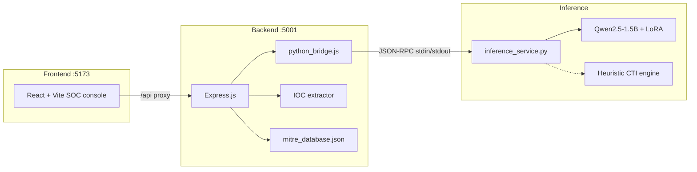

# CyberSentinel

**Explainable CTI analyst AI** — maps unstructured cyber threat intelligence to MITRE ATT&CK techniques, with chain-of-thought reasoning you can audit.

Paste an EDR log, malware write-up, or CTI snippet. CyberSentinel returns:

- Step-by-step analysis in `<reasoning>` tags
- A single ATT&CK technique ID in `<answer>` tags (`T1059`, `T1059.001`, …)
- Enriched tactic / technique metadata
- Extracted IOCs (IPs, domains, hashes, registry keys, binaries)

The policy is a **Qwen2.5-1.5B-Instruct** model fine-tuned with **GRPO** (Group Relative Policy Optimization) on [`tumeteor/Security-TTP-Mapping`](https://huggingface.co/datasets/tumeteor/Security-TTP-Mapping). A full-stack SOC console sits on top of the same inference contract.

> This project classifies and explains observed adversary behavior. It does not generate exploits, payloads, or attack procedures.

---

## Features

- **Explainable mapping** — reasoning drawer + MITRE technique badge, not a black-box ID
- **Local inference** — CUDA, Apple Silicon MPS, or CPU; heuristic CTI engine if PyTorch is unavailable
- **SOC console** — dark-theme React UI, investigation sessions, ATT&CK matrix navigator
- **IOC extraction** — IPs, domains, hashes, registry paths, binaries, suspicious APIs; CSV / markdown export
- **Benchmark probes** — eight held-out-style CTI samples with expected technique IDs
- **GRPO training notebook** — Unsloth 4-bit + vLLM + TRL, targeted at a 16GB Kaggle T4

---

## Architecture



**Decide vs. display.** The Python process owns generation and XML parsing. Express enriches the technique ID from a local ATT&CK catalog, extracts IOCs, and serves the SPA. The browser never talks to the model directly.

| Layer | Path | Role |
| --- | --- | --- |
| Training | `malware-behavior.ipynb` | GRPO fine-tune, reward functions, adapter export |
| Evaluation | `evaluate_cti_agent.py` | Format adherence, accuracy, reasoning length |
| Weights | `grpo_cti_tokenizer_model/`, `grpo_cti_lora_adapters/` | Tokenizer + PEFT LoRA (not committed) |
| API | `backend/` | Express routes + Python bridge |
| Console | `frontend/` | Sessions, chat, matrix, IOC drawer |
| Prompt contract | [`PROMPT.md`](./PROMPT.md) | Recreation prompt, system prompt, sample probes |

---

## Quick start

### Prerequisites

- Node.js 18+
- Python 3.10+ (3.12 recommended)
- Optional, for live neural inference: `torch`, `transformers`, `peft`

### Install and run (development)

```bash
# from repo root
npm install
cd backend && npm install && cd ../frontend && npm install && cd ..

# both processes: Express :5001 + Vite :5173
npm run dev
```

Open **http://localhost:5173**. Vite proxies `/api` to the backend.

### Production-style serve

```bash
npm run build    # builds frontend/dist and installs backend deps
npm start        # Express on :5001, serves the SPA if dist exists
```

### Neural inference (optional)

Without PyTorch the API still answers via the LoRA-aligned heuristic engine. To load the real model:

```bash
pip install torch transformers peft
```

Place adapters next to the repo root (gitignored):

```text
grpo_cti_tokenizer_model/     # preferred (tokenizer + adapters)
grpo_cti_lora_adapters/       # fallback
```

Device selection is automatic: **CUDA → MPS → CPU**. Status is visible in the header pill and `GET /api/status`.

---

## Using the console

1. Paste a CTI snippet or pick a **sample probe** from the sidebar.
2. Choose **CTI** mode for structured mapping, or **interactive** for analyst chat.
3. Expand the reasoning drawer; click the technique badge for ATT&CK details.
4. Open **ATT&CK Matrix** to browse tactics/techniques.
5. Open **IOCs** for session-wide indicators; **export** a markdown investigation report.

Sessions persist in `localStorage` under `cybersentinel_sessions_v1`.

---

## API

Base URL: `http://localhost:5001`

| Method | Path | Description |
| --- | --- | --- |
| `GET` | `/health` | Liveness |
| `GET` | `/api/status` | Model loaded, device, adapter path, uptime |
| `GET` | `/api/samples` | Benchmark CTI probes |
| `GET` | `/api/mitre/tactics` | ATT&CK tactics |
| `GET` | `/api/mitre/techniques` | Techniques (`?query=&tactic=`) |
| `GET` | `/api/mitre/technique/:id` | One technique (parent fallback for sub-IDs) |
| `POST` | `/api/chat` | Chat / mapping |
| `POST` | `/api/analyze` | Structured one-shot analysis |

### `POST /api/chat`

```json
{
  "message": "Process cmd.exe spawned powershell.exe -enc JABzAD0A...",
  "mode": "cti",
  "temperature": 0.1,
  "max_new_tokens": 256
}
```

`mode` is `"cti"` (wraps the text as `CTI snippet:\n…`) or `"interactive"` (raw user turn).

Response includes `reasoning`, `answer`, `mitre`, `iocs`, `engine`, `device`, and `latencyMs`.

```bash
curl -s http://localhost:5001/api/chat \
  -H 'Content-Type: application/json' \
  -d '{"message":"The malware wrote a Run key under HKCU\\Software\\Microsoft\\Windows\\CurrentVersion\\Run pointing to payload.exe","mode":"cti"}'
```

---

## Training the CTI agent

Notebook: [`malware-behavior.ipynb`](./malware-behavior.ipynb)

| Setting | Value |
| --- | --- |
| Base model | `Qwen/Qwen2.5-1.5B-Instruct` |
| Quantization | 4-bit Unsloth QLoRA |
| Algorithm | GRPO via `trl==0.15.2` (no critic / PPO) |
| Dataset | `tumeteor/Security-TTP-Mapping` |
| Hardware | Kaggle T4 16GB, **fp16 only** |
| LoRA rank | 16 (`q/k/v/o` + MLP projections) |
| Group size `G` | 4 (must divide batch size) |
| Completion length | 256 tokens |

On Kaggle T4, set this **before** `import unsloth`:

```python
os.environ["UNSLOTH_VLLM_NO_FLASHINFER"] = "1"
```

Do not reinstall `torch` on Kaggle — it breaks the Unsloth/vLLM stack.

### Reward functions

| Function | Signal |
| --- | --- |
| `format_reward_func` | +1.0 if output is strictly `<reasoning>…</reasoning><answer>…</answer>` |
| `correctness_reward_func` | +2.0 exact ID match, else −1.0 |
| `soft_format_reward_func` | +0.25 per tag pair (cold-start scaffolding) |

Ground-truth matching is **exact**: `T1059` does not satisfy `T1059.001`.

### Evaluate adapters

```bash
python evaluate_cti_agent.py \
  --adapter_path ./grpo_cti_tokenizer_model \
  --base_model Qwen/Qwen2.5-1.5B-Instruct
```

Reports format adherence, accuracy, and reasoning word count on a five-snippet probe set.

The inference **system prompt must not be paraphrased** — the policy was rewarded against the contract in [`PROMPT.md`](./PROMPT.md).

---

## Repository layout

```text
CyberSentinel/
├── PROMPT.md                      # Mock / recreation + inference prompts
├── README.md
├── package.json                   # npm run dev | start | build
├── malware-behavior.ipynb         # GRPO training
├── evaluate_cti_agent.py
├── backend/
│   ├── server.js
│   ├── python_bridge.js
│   ├── inference_service.py
│   ├── routes/
│   ├── utils/ioc_extractor.js
│   └── data/mitre_database.json
├── frontend/
│   ├── src/
│   └── vite.config.js
└── memory-bank/                   # knbase governance
```

Large artifacts (`grpo_cti_*.zip`, `*.safetensors`, adapter directories) are gitignored. Keep them on disk or Git LFS if you need to share weights.

---

## Configuration

| Variable / setting | Default | Notes |
| --- | --- | --- |
| `PORT` | `5001` | Express bind |
| Vite port | `5173` | Dev UI |
| Temperature | `0.1` | UI Settings modal |
| `max_new_tokens` | `256` | Matches training completion length |
| Base model | `Qwen/Qwen2.5-1.5B-Instruct` | Hugging Face id |
| Adapter path | `./grpo_cti_tokenizer_model` | Falls back to `grpo_cti_lora_adapters` |
| Inference timeout | 60s | Python bridge queue |

---

## Scripts

| Command | What it does |
| --- | --- |
| `npm run dev` | Backend `--watch` + Vite together |
| `npm run backend` / `npm run frontend` | One side only |
| `npm run build` | Production SPA + backend `npm install` |
| `npm start` | Serve API (and SPA from `frontend/dist`) |

---

## Known limitations

- Single-label mapping: one technique per snippet.
- Heuristic fallback covers a fixed keyword set; install PyTorch for the trained policy.
- Piper-style / cloud LLM backends are out of scope — this stack is local Qwen + LoRA.
- ATT&CK catalog in `mitre_database.json` is a curated subset used for UI enrichment, not a full STIX bundle.

---

## License and use

For research and defensive SOC workflows. Do not use this repository to build offensive tooling. Threat examples in sample probes are descriptive telemetry, not working exploits.
